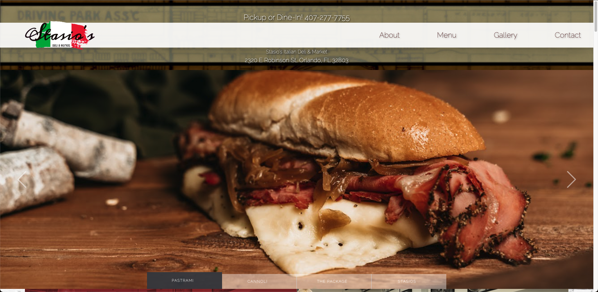
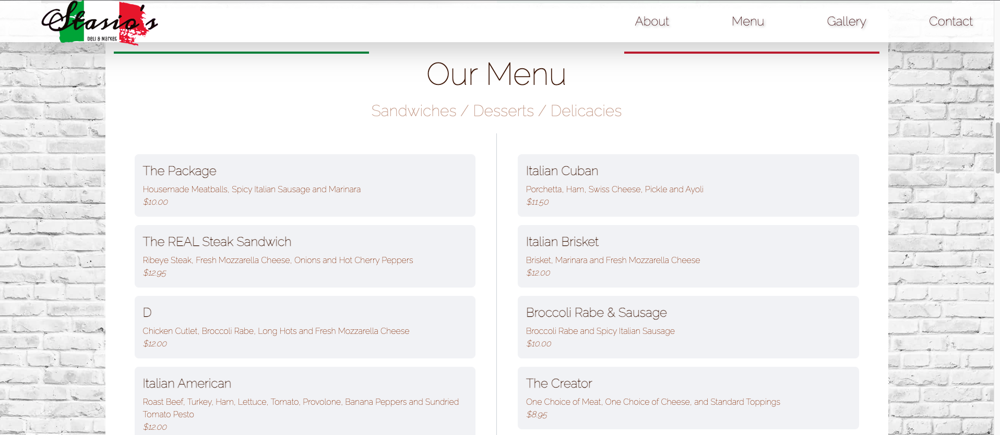
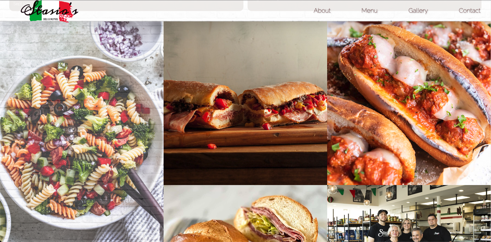
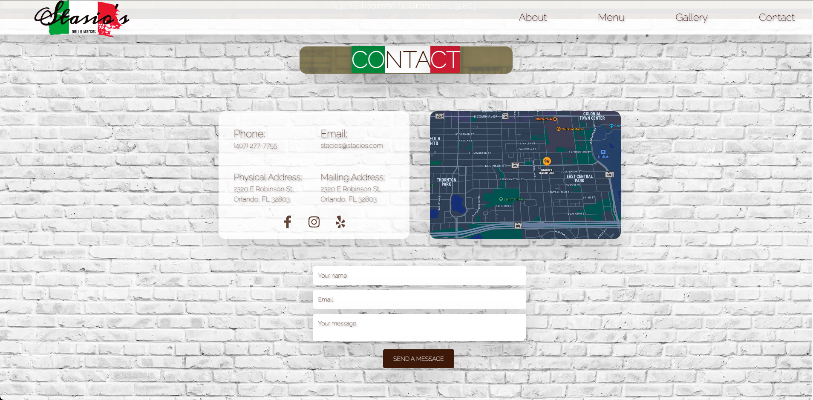
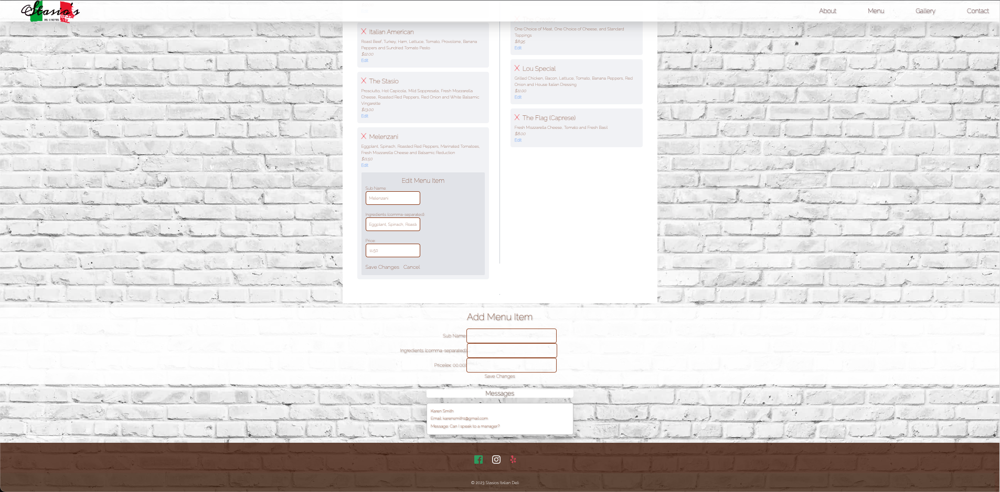

# Stasio's

[](https://opensource.org/licenses/MIT)


## Table of Contents
- [Description](#description)
- [Installation](#installation)
- [Usage](#usage)
- [Contributing](#contributing)
- [Tests](#tests)
- [Questions](#questions)
- [License](#license)


## Description


Stasio's is a personalized restaurant website or web application built using Front-end framework components and Back-end databases to implement seemless functionalities that worked hand in hand with displaying or dinamically rendering menus, contact forms, galleries and reviews. It acts as an experience for the user to get a visual representation of the family environment it upholds and the fresh delicious food items served with some history of the Stasio family.


## Installation
Follow these steps to set up and run our MERN stack single-page application on your local machine:

### Prerequisites

Before you begin, ensure you have met the following requirements:

- [Node.js](https://nodejs.org/) and [npm](https://www.npmjs.com/) (Node Package Manager) installed on your machine.
- [MongoDB](https://www.mongodb.com/) installed and running, or access to a MongoDB instance (including the connection URI).

### Clone the Repository

1. Clone this GitHub repository to your local machine:

   ```bash
   git clone https://git@github.com:NickSweet1/Stasios.git


2. Navigate to the project directory:
  ```bash
cd Stasios 
```

3. Install front-end dependencies (This will run concurrently and install the back-end dependencies as well):  
```bash
npm install
``` 

4. Start the application:
```bash
npm run develop
``` 

## Usage


### Accessing the Website:

1. Open your web browser.
2. Visit the deployed website using the following link: [Stasio's Website](https://stasios-7fcd485311cd.herokuapp.com/).

### Exploring the Website:

#### Navigate through the various sections of the website to explore its features:

1. Homepage: Provides an overview of the restaurant and its family-oriented environment.
2. Menu: Browse the restaurant's menu items and descriptions.
3. Gallery: View images of the restaurant and its dishes.
4. Contact: Find contact information and a form to get in touch with the restaurant.
5. Dashboard: Access admin functionalities.


## Contributing

If you would like to contribute as a developer, you can contact us with your suggestions and screenshots before submitting a pull request. Before starting any substantial work, it's recommended to open an issue to discuss your proposed changes with the lead developers beforehand.

# Screenshots

# a. Homepage <br><br>
# b. Menu <br><br>
# c. Gallery <br><br>
# d. Contact <br><br>
# d. Dashboard <br><br>

 
 
## Refferences


1. <a href = https://www.w3schools.com/>W3Schools</a>


2. <a href = https://stackoverflow.com/>Community Forums & Stack Overflow</a>


3. <a href = https://www.apollographql.com/docs/react/data/mutations/>Mutations in Apollo Client</a>


4. <a href= https://coding-boot-camp.github.io/full-stack/mongodb/deploy-with-heroku-and-mongodb-atlas>Deploy with Heroku and MongoDB Atlas</a>


5. <a href = https://codesandbox.io/s/murga96-hero-slider-version-f0ewgd>Hero Slider</a>


6. <a href = https://favicon.io/favicon-converter/>Favicon Converter</a>

7. <a href = https://developer.mozilla.org/en-US/docs/Glossary/MVC>MDN Web Docs</a>

8. <a href = https://legacy.reactjs.org/docs/components-and-props.html>Components and Props</a>

9. <a href = https://tailwindcss.com/>TailwindCSS Documentation</a>

## Deployment Link
https://stasios-d832d14ac640.herokuapp.com/


## Github Repository
https://github.com/NickSweet1/Stasios

## Questions


For any questions, please contact us:


- GitHub: [Stasio's](https://github.com/NickSweet1/Stasios)

## License


This project is licensed under the MIT License.
